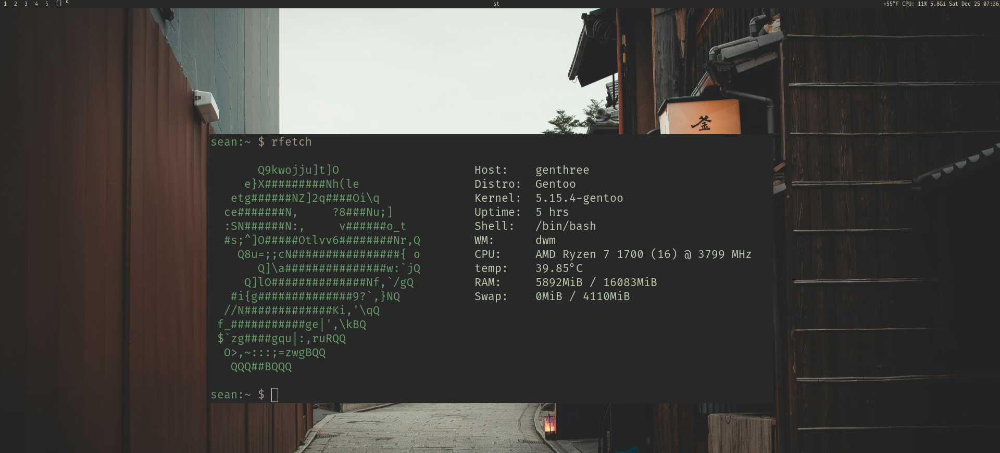

<center>
	<h3></h3>
	<p>cli sys-info tool written in rust 🚀</p>

	<a href="./LICENSE"></a>
</center>



In all honesty, you should use [neofetch](https://github.com/dylanaraps/neofetch) or [pfetch](https://github.com/dylanaraps/pfetch) rather than this, in it's current state this works but it lacks a lot of things others have to offer. 

Due to it's simple nature, this is in turn very hackable, it pulls most of the info from the [sysinfo](https://docs.rs/sysinfo/0.22.3/sysinfo/index.html) crate, in the future this could be replaced with only pulling info from the kernel. 

In reality, rust is not a good language for something like this. However, it's my favorite to write in.


Only tested on Linux and likely works on \*nix systems, the gentoo logo is hardcoded because that's the distribution I use and I don't know how to properly display ascii art next to text.

#### installation

It is recommended you have [cargo](https://doc.rust-lang.org/cargo/getting-started/installation.html) installed

For the last copy command, anywhere in the path will work in place of `/usr/bin`

```
$ git clone https://github.com/NotCreative21/rfetch
$ cd rfetch
$ cargo build --release
$ sudo cp target/release/rfetch /usr/bin/
```

#### future improvements
* alternate way to detect WM/DE
* color display
* proper asii logo integration instead of a hardcoded string
* terminal detection
* gpu detection
* gtk theme/icon theme


### credit

No code was directly copied from any of these, after all, this is written in a different language, however tools like these inspired me to make this.

* [pfetch](https://github.com/dylanaraps/pfetch)
* [ufetch](https://gitlab.com/jschx/ufetch)
* [neofetch](https://github.com/dylanaraps/neofetch)
